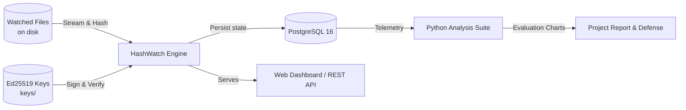

# HashWatch 🛡️

[](https://openjdk.org/)
[](https://spring.io/projects/spring-boot)
[](https://www.postgresql.org/)
[](https://ed25519.cr.yp.to/)
[](LICENSE)

> **A Cryptographically Signed File Integrity Monitoring System**  
> Final-Year Project — Group 3 (CSBS, Asansol Engineering College)  
> Central Upstream Repository: [https://github.com/PG300604/HashWatch.git](https://github.com/PG300604/HashWatch.git)

---

## 📌 Start Here
1. **Developer Setup:** [`docs/SETUP.md`](docs/SETUP.md) — Follow this to get the project building and running locally.
2. **Team Domains & Agile Model:** [`docs/ROLES.md`](docs/ROLES.md) — How our team operates dynamically across weekly sprints.
3. **Weekly Sprint Tasks & Deadlines:** [`docs/SPRINT_PLAN.md`](docs/SPRINT_PLAN.md) and [`docs/WEEKLY_DEADLINES.md`](docs/WEEKLY_DEADLINES.md) — What to work on each week, which folders to touch, and how to update docs.

---

## 👥 Team & Domain Specialization Matrix

Our project uses **Event-Based Agile Development**. Work is distributed in weekly sprints based on domain competence, but workforce shifts fluidly to where it is needed most so every member gets equal hands-on participation.

| Member | GitHub Handle | Primary Domains |
| :--- | :--- | :--- |
| **Priyanshu** (Lead) | [`@PG300604`](https://github.com/PG300604) | **Backend**, **DBMS**, **DevOps**, **Analysis**, **Cryptology** |
| **Riya** | Contributor | **Cryptology**, **API**, **Frontend**, **DBMS** |
| **Samarjeet** | Contributor | **Backend**, **Cryptology** |

---

## 🏗️ System Architecture at a Glance



---

## 🚀 Quick Start (Local Run in 60 Seconds)

### 1. Fork & Clone
```bash
git clone https://github.com/<YOUR_USERNAME>/HashWatch.git
cd HashWatch
```

### 2. Run with H2 In-Memory DB (No Docker/DB setup needed)
```bash
mvn spring-boot:run -Dspring-boot.run.profiles=h2
```
Or with PostgreSQL via Docker:
```bash
docker compose up -d
mvn spring-boot:run
```

### 3. Open Web Dashboard
Navigate to: **[http://localhost:8080](http://localhost:8080)**

---

## 📚 Complete Documentation Index

| Document | Purpose |
| :--- | :--- |
| [`docs/BRAIN.md`](docs/BRAIN.md) | **Project Brain & Architecture Base:** High-level vision, ADRs, dynamic sprint assignments, and collaboration philosophy. |
| [`docs/PRD.md`](docs/PRD.md) | **Product Requirements Document:** Problem statement, personas, functional requirements (FR1–FR8), non-functional goals. |
| [`docs/TRD.md`](docs/TRD.md) | **Technical Requirements Document:** Architecture, tech stack rationale, cryptographic specs (SHA-256 + Ed25519), REST API schemas. |
| [`docs/ERD.md`](docs/ERD.md) | **Entity-Relationship Document:** Complete Mermaid ER diagram, PostgreSQL DDL script, indexes, constraints. |
| [`docs/DFD.md`](docs/DFD.md) | **Data Flow Diagrams:** Level 0 Context, Level 1 Process Breakdown, Level 2 Detailed Sequence Flows. |
| [`docs/ROLES.md`](docs/ROLES.md) | **Roles & Agile Model:** Domain matrix, event-based workflow, step-by-step Fork & PR guide. |
| [`docs/SPRINT_PLAN.md`](docs/SPRINT_PLAN.md) | **Weekly Sprint Plan:** Detailed weekly task breakdown (S1 to S6), folder targets, doc update rules, and Definition of Done. |
| [`docs/TIMELINE.md`](docs/TIMELINE.md) | **Gantt Chart Milestone Timeline:** Visual roadmap of project deliverables. |
| [`docs/WEEKLY_DEADLINES.md`](docs/WEEKLY_DEADLINES.md) | **Sprint Deadlines Checklist:** Acceptance criteria and submission deadlines. |
| [`docs/PACKAGE_STRUCTURE.md`](docs/PACKAGE_STRUCTURE.md) | **Folder Layout:** Map of packages, classes, resources, and tests. |
| [`docs/SETUP.md`](docs/SETUP.md) | **Developer Setup:** Java 17, Maven, PostgreSQL, Python virtual environment, troubleshooting. |
| [`docs/CONTRIBUTING.md`](docs/CONTRIBUTING.md) | **Contribution & Docs Rules:** Branch naming, conventional commits, rule of updating docs with every PR. |
| [`docs/RESEARCH_BENCHMARKS.md`](docs/RESEARCH_BENCHMARKS.md) | **Academic Papers:** Published benchmark comparisons (snaproot, Ed25519 reference, commodity hardware hashing). |

---

## 🧪 Testing & Benchmarks

- **Run Java Unit & Security Tests:**
  ```bash
  mvn test
  ```
- **Run Python Cryptographic & Latency Benchmarks:**
  ```bash
  cd python-analysis
  pip install -r requirements.txt
  python overhead_benchmark.py
  python latency_analysis.py
  ```
  Generated charts are saved to `python-analysis/charts/`.
