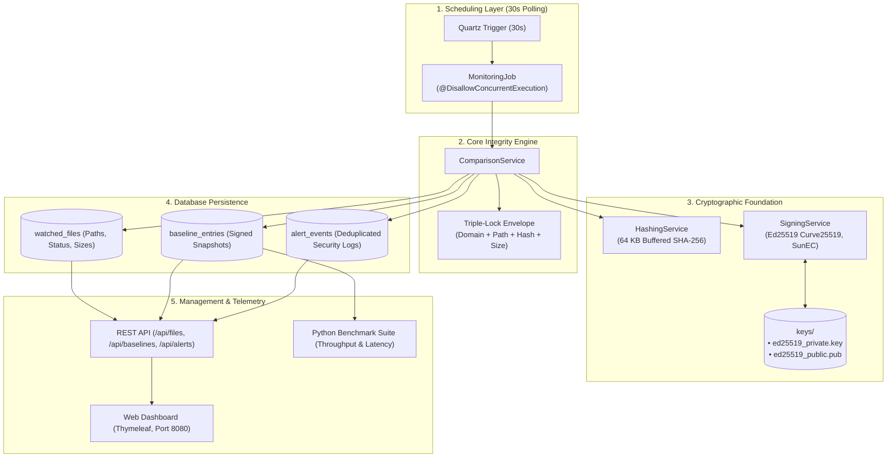
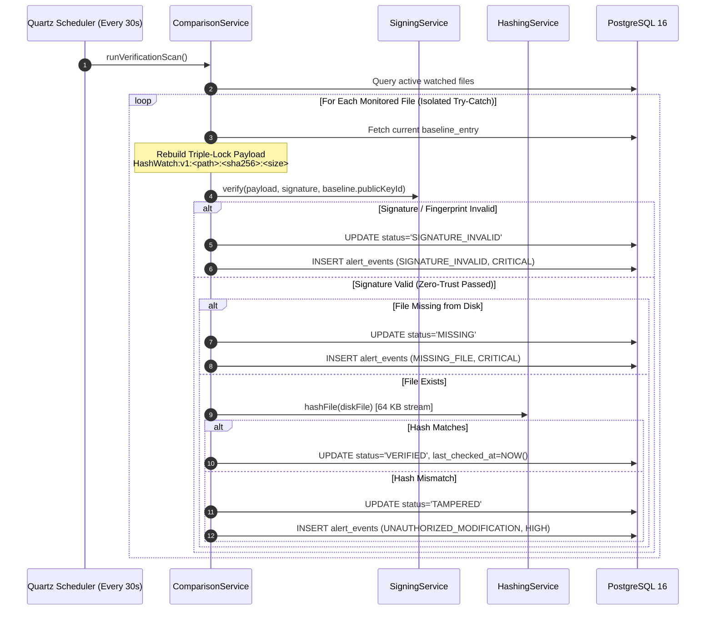

# HashWatch 🛡️

[](https://openjdk.org/)
[](https://spring.io/projects/spring-boot)
[](https://www.postgresql.org/)
[](https://ed25519.cr.yp.to/)
[](https://github.com/PG300604/HashWatch)
[](https://github.com/PG300604/HashWatch)
[](LICENSE)

> **A Cryptographically Signed, Zero-Trust File Integrity & Baseline Monitoring System**  
> Department of Computer Science and Business Systems (CSBS), Asansol Engineering College  
> Upstream Repository: [https://github.com/PG300604/HashWatch.git](https://github.com/PG300604/HashWatch.git)

---

## 🎯 Executive Summary & Vision

In enterprise IT and cloud environments, unauthorized modifications to critical system files (`/etc/pam.d/`, `/etc/sudoers`, Windows system drivers, application configurations, payment binary files) represent the primary vector for stealth backdoors, privilege escalation, and advanced persistent threats (APTs).

Traditional File Integrity Monitoring (FIM) systems (such as legacy Tripwire or AIDE) compute plain hashes and store them in flat files or relational database tables. If an attacker gains administrative or SQL access, they can perform a **Baseline Poisoning Attack**—altering the file on disk and silently rewriting the database's expected hash, rendering the monitoring system completely blind.

**HashWatch solves this architectural flaw** by introducing **Zero-Trust Asymmetric Baselines**:
1. Every monitored file baseline is sealed with a digital signature using the **Edwards-curve Digital Signature Algorithm (Ed25519)**.
2. During continuous automated verification loops, the system **cryptographically verifies the baseline's digital signature before trusting the record**.
3. If an attacker tampers with the file, HashWatch flags **`TAMPERED`**. If an attacker tampers with the database, HashWatch flags **`SIGNATURE_INVALID`**.

---

## 💡 Core Innovations & Architectural Highlights

```
┌────────────────────────────────────────────────────────────────────────┐
│                        HASHWATCH 5 CORE PILLARS                        │
├────────────────────────────────────────────────────────────────────────┤
│ 1. 🔏 Zero-Trust Baselines     : Authenticity verified before matching │
│ 2. 🛡️ Triple-Lock Envelope     : Domain + Path + Hash + Size binding   │
│ 3. 🔑 Fingerprint Pinning      : Stops rogue public key substitution   │
│ 4. ⚙️ 5-State Integrity Engine : Distinguishes file vs DB tampering    │
│ 5. 🪶 In-Place & Zero Bloat    : Files stay in place; < 64 KB RAM      │
└────────────────────────────────────────────────────────────────────────┘
```

### 1. The Triple-Lock Canonical Envelope
To prevent database row-swapping attacks (copying a valid signature from a benign file into a compromised file's row), HashWatch binds the signature to a canonical composite payload:
$$\text{Canonical Payload} = \text{HashWatch:v1:} + \text{NormalizedPath} + \text{":"} + \text{SHA256} + \text{":"} + \text{FileSizeBytes}$$
* **Domain Tag (`HashWatch:v1`):** Enforces protocol separation (RFC 8032).
* **Normalized Absolute Path:** Cryptographically binds the signature specifically to that file.
* **Streaming SHA-256 Digest:** Validates disk content integrity.
* **Exact Byte Size:** Provides a secondary physical barrier against hash collisions.

### 2. Fingerprint-Pinned Key Verification
Every baseline snapshot stores the SHA-256 fingerprint (`publicKeyId`) of the authorized signing key. During verification, HashWatch validates that the active public key's fingerprint matches the record before verifying the curve equation, eliminating in-memory key substitution attacks.

### 3. The 5-State Deterministic Integrity Machine
Unlike binary "Pass/Fail" monitors, HashWatch implements a granular 5-state machine:
* **`VERIFIED`:** Baseline signature is authentic and live disk content matches expected hash.
* **`TAMPERED`:** Baseline signature is authentic, but disk file has been altered.
* **`MISSING`:** File exists in database but has been deleted from disk.
* **`SIGNATURE_INVALID`:** Cryptographic signature failed verification—alerts administrator that the **database record or signature was compromised**.
* **`UNTRACKED`:** Registered file awaiting baseline establishment.

### 4. Alert Fatigue Mitigation (State-Transition Gating)
In a 30-second polling cycle, an unthrottled monitor checking a modified file generates **2,880 alerts/day**. HashWatch implements state-transition gating: new `AlertEvent` entries are generated only upon active state transitions or when no unresolved alert is open, preventing operator fatigue and database bloating.

### 5. In-Place Monitoring (Zero File Bloat)
HashWatch is an **in-place integrity monitor, not a cloud drive or file vault**. Files remain untouched in their native filesystem paths. Memory consumption is capped at $<64$ KB per stream regardless of whether the target file is 10 KB or 50 GB.

---

## 🏗️ System Architecture & Workflow



---

## 🔄 Zero-Trust Verification Sequence



---

## 🚀 Quick Start (Running Locally in 60 Seconds)

### Prerequisites
* **Java 17 LTS** (Adoptium / Eclipse Temurin OpenJDK recommended)
* *Git* installed on system

### 1. Clone Repository
```bash
git clone https://github.com/PG300604/HashWatch.git
cd HashWatch
```

### 2. Run with In-Memory H2 Database (Default — Zero Setup)
The project includes bundled Apache Maven Wrapper scripts (`mvnw` / `mvnw.cmd`):
```powershell
# Windows PowerShell
.\mvnw.cmd spring-boot:run

# Linux / macOS
./mvnw spring-boot:run
```

### 3. (Optional) Run with Production PostgreSQL 16
To run with PostgreSQL via Docker Compose:
```bash
docker compose up -d
.\mvnw.cmd spring-boot:run -Dspring-boot.run.profiles=postgres
```

### 4. Access Web Dashboard
Open your web browser and navigate to:  
👉 **[http://localhost:8080](http://localhost:8080)**

---

## 🧪 Automated Testing & Verification

HashWatch maintains an automated test suite across all cryptographic, database, scheduler, and comparison engine components:

```powershell
# Windows
.\mvnw.cmd test

# Linux / macOS
./mvnw test
```

### Current Test Suite Breakdown (33 Tests):
| Test Class | Component Tested | Tests Run | Status |
| :--- | :--- | :---: | :---: |
| [`ComparisonServiceTest`](src/test/java/com/hashwatch/service/ComparisonServiceTest.java) | Triple-Lock envelope, zero-trust verification, tamper alerts, dedup | 10 | ✅ Passing |
| [`RepositoryIntegrationTest`](src/test/java/com/hashwatch/repository/RepositoryIntegrationTest.java) | JPA schemas, enum mappings, unique paths, cascade/set-null FK rules | 8 | ✅ Passing |
| [`SigningServiceTest`](src/test/java/com/hashwatch/service/SigningServiceTest.java) | Native Ed25519 signing, verification, key persistence, fingerprint pinning | 6 | ✅ Passing |
| [`HashingServiceTest`](src/test/java/com/hashwatch/service/HashingServiceTest.java) | 64 KB buffered SHA-256 streaming, memory safety, empty/null validation | 5 | ✅ Passing |
| [`MonitoringJobTest`](src/test/java/com/hashwatch/scheduler/MonitoringJobTest.java) | Quartz trigger loop, exception boundaries without refire loops | 3 | ✅ Passing |
| [`HashWatchApplicationTests`](src/test/java/com/hashwatch/HashWatchApplicationTests.java) | Full Spring Boot context bootstrap | 1 | ✅ Passing |
| **Total** | **All System Layers** | **33** | **✅ 100% GREEN** |

---

## 📖 Deep Dives & Documentation Sitemap

For in-depth architectural specifications, research literature comparisons, and contributor guides:

| Document | Description |
| :--- | :--- |
| **[`docs/GUIDE.md`](docs/GUIDE.md)** | **Team & Contributor Guide:** Agile development workflow, branching protocol, conventional commits, and team matrix. |
| **[`docs/PRD.md`](docs/PRD.md)** | **Product Requirements Document:** Target personas, security standards (PCI-DSS 11.5, SOC 2), functional requirements. |
| **[`docs/TRD.md`](docs/TRD.md)** | **Technical Requirements Document:** Detailed cryptographic specifications, dual-profile database configurations, REST API contracts. |
| **[`docs/ERD.md`](docs/ERD.md)** | **Entity-Relationship Document:** Complete relational schema, PostgreSQL DDL script, indexing strategies, referential integrity. |
| **[`docs/DFD.md`](docs/DFD.md)** | **Data Flow Diagrams:** Level 0 Context diagram, Level 1 decomposition, Level 2 sub-process sequence flows. |
| **[`docs/RESEARCH_BENCHMARKS.md`](docs/RESEARCH_BENCHMARKS.md)** | **Academic Research & Benchmarks:** Comparison against *snaproot* (arXiv:2606.10625) and Bernstein's Ed25519 reference paper. |
| **[`docs/SETUP.md`](docs/SETUP.md)** | **Developer Onboarding:** Comprehensive local machine configuration and troubleshooting guide. |

---

## 👥 Academic Project Team & Credits

**HashWatch** is developed by **Group 3**, Department of Computer Science and Business Systems (**CSBS**), **Asansol Engineering College**:

* **Priyanshu Ghosh** ([`@PG300604`](https://github.com/PG300604)) — *Project Lead, Backend, DBMS, DevOps, Cryptology*
* **Riya** ([`@riyaaa0710`](https://github.com/riyaaa0710)) — *Cryptology, REST API, Frontend, DBMS*
* **Samarjeet Kumar** ([`@samarjeet-kr`](https://github.com/samarjeet-kr)) — *Backend, Cryptology, Performance Analysis*

---

## 📜 License

This project is licensed under the **MIT License** — see the [`LICENSE`](LICENSE) file for details.
