# Project Brain & Architecture Knowledge Base — HashWatch

**Project Title:** HashWatch: Cryptographically Signed File Integrity Monitoring System  
**Academic Group:** Group 3 (CSBS, Asansol Engineering College)  
**Lead & Repo Admin:** Priyanshu Ghosh ([`@PG300604`](https://github.com/PG300604))  
**Central Repository:** [https://github.com/PG300604/HashWatch.git](https://github.com/PG300604/HashWatch.git)  

---

## 1. Project Philosophy & Collaboration Core

### The "Equal Opportunity & Mutual Trust" Model
HashWatch is designed from the ground up as a shared team effort. To avoid situations where one teammate does all the work or members get locked into rigid, isolated silos:
1. **The Base is Pre-Structured:** The entire package structure, interfaces, DTOs, configurations, and documentation have been initialized up front so everyone starts from an organized, professional scaffold.
2. **Implementation is Distributed:** The business logic, algorithms, queries, controllers, and templates are structured as starter skeletons with clear `TODO: [Sprint X - Domain] Assigned to: <Name>` guides.
3. **Fluid Workforce Allocation:** Domains are not static silos. While everyone selected their core domains:
   - **Priyanshu:** Backend, DBMS, DevOps, Analysis, Cryptology
   - **Riya:** Cryptology, API, Frontend, DBMS
   - **Samarjeet:** Backend, Cryptology
   Work is organized in **weekly sprints**. If the DBMS schema needs more workforce in Week 1, Priyanshu and Riya collaborate on it; if Backend comparison needs extra horsepower in Week 2, Samarjeet and Priyanshu tackle it together.

---

## 2. Architecture Decision Records (ADRs)

### ADR-001: 64 KB Chunked Streaming for SHA-256 Hashing
- **Context:** Reading multi-gigabyte files directly into memory causes JVM `OutOfMemoryError`.
- **Decision:** Stream files through a 64 KB buffered `FileInputStream` into standard `MessageDigest.getInstance("SHA-256")`.
- **Consequence:** Constant $\mathcal{O}(1)$ memory consumption (< 64 KB per stream) with throughput reaching ~1,900 MB/s on modern commodity hardware.

### ADR-002: Asymmetric Digital Signatures via Ed25519 (RFC 8032)
- **Context:** Storing hashes in standard database tables allows anyone with database access to modify both the file and the database record undetectably.
- **Decision:** Sign the SHA-256 digest using Edwards-curve Digital Signature Algorithm (Ed25519) with a private key stored outside the database.
- **Consequence:** Guarantees tamper-evidence. If an attacker modifies the baseline record in PostgreSQL, signature verification fails (`SIGNATURE_INVALID`) during the next polling pass.

### ADR-003: Quartz Job Scheduler vs Spring `@Scheduled`
- **Context:** System requires robust periodic execution with support for runtime re-triggering and future clustering.
- **Decision:** Use Spring Boot Quartz starter with simple triggers (default interval: 30 seconds).
- **Consequence:** Clean separation of job definitions from business logic and support for dynamic trigger adjustments.

### ADR-004: Dual-Profile Database Strategy (PostgreSQL + In-Memory H2)
- **Context:** Teammates may not have PostgreSQL or Docker installed immediately.
- **Decision:** Default `spring.profiles.active=h2` in `application.properties` (`application-h2.properties`) for zero-install instant local dev, and provide `application-postgres.properties` for production PostgreSQL 16 (`-Dspring-boot.run.profiles=postgres`), backed by HikariCP (`HashWatchHikariPool`).
- **Consequence:** Immediate onboarding for any teammate on any operating system without environmental blockers.

### ADR-005: Thymeleaf Server-Side UI vs SPA
- **Context:** The project requires a clean dashboard for demonstrations without requiring Node.js, npm, or complex frontend build pipelines.
- **Decision:** Thymeleaf HTML5 templates with vanilla CSS and asynchronous `fetch()` JavaScript.
- **Consequence:** Instant hot reload, zero frontend dependencies, and fast rendering.

### ADR-006: Strongly-Typed Domain Enums + `@ColumnDefault` for Schema Migration Safety (Sprint 1)
- **Context:** Raw `String` status/severity columns are prone to typos across teammates, and schema migrations on existing rows can fail if `status` is omitted.
- **Decision:** Created `FileStatus`, `EventType`, and `AlertSeverity` enums mapped with `@Enumerated(EnumType.STRING)` and `@ColumnDefault("'UNTRACKED'")` / `@PrePersist` hooks, plus `@OnDelete(CASCADE)` on `BaselineEntry` and `@OnDelete(SET_NULL)` on `AlertEvent`.
- **Consequence:** Compile-time type safety in Java, human-readable strings in SQL/Python analysis, and safe cascade/set-null referential integrity verified by 8 `@DataJpaTest` tests.

### ADR-007: Zero-Binary Apache Maven Wrapper (`mvnw` / `mvnw.cmd`) (Sprint 1)
- **Context:** Teammates on Windows/Linux may not have Apache Maven installed globally on their system `PATH`.
- **Decision:** Bundled `only-script` Maven Wrapper scripts (`mvnw.cmd` and `mvnw` with `.gitattributes` enforcing `eol=lf` and `+x` permissions) that auto-download Maven 3.9.9 into `~/.m2/wrapper/dists`.
- **Consequence:** Every developer and CI runner builds with the exact same Maven 3.9.9 binary out of the box.

---

## 3. Team Domains & Weekly Sprint Assignments

```mermaid
flowchart TD
    subgraph Sprint1["Sprint 1: Crypto & DB Foundations"]
        S1P["✅ Priyanshu: DevOps & DB (Maven Wrapper, HikariCP, Enums, JPA Indexes, @DataJpaTest)"]
        S1R["✅ Riya: Cryptology (Ed25519 key gen & sign/verify)"]
        S1S["✅ Samarjeet: Cryptology & Backend (SHA-256 streaming)"]
    end

    subgraph Sprint2["Sprint 2: Comparison Engine & Scheduler"]
        S2P["Priyanshu: Backend (ComparisonService state machine)"]
        S2S["Samarjeet: Backend (Quartz MonitoringJob loop)"]
        S2R["Riya: DBMS & API (AlertEvent queries & triage logic)"]
    end

    subgraph Sprint3["Sprint 3: REST API Layer"]
        S3R["Riya: API (FileController & BaselineController)"]
        S3P["Priyanshu: API & Backend (AlertController & manual scans)"]
        S3S["Samarjeet: Cryptology (Detached signature validation)"]
    end

    subgraph Sprint4["Sprint 4: Web Dashboard UI"]
        S4R["Riya: Frontend (Thymeleaf UI & alerts view)"]
        S4S["Samarjeet: Frontend/Backend (DashboardViewController stats)"]
        S4P["Priyanshu: DevOps (Local testing & profiles)"]
    end

    subgraph Sprint5["Sprint 5: Benchmarking & CI"]
        S5P["Priyanshu: Analysis & DevOps (CI pipeline & overhead scripts)"]
        S5S["Samarjeet: Analysis (Latency distributions & P95 metrics)"]
        S5R["Riya: Cryptology (Tamper injection test cases)"]
    end

    subgraph Sprint6["Sprint 6: Final Verification & Defense"]
        ALL["All Members: Academic comparisons, report synthesis & demo prep"]
    end

    Sprint1 --> Sprint2 --> Sprint3 --> Sprint4 --> Sprint5 --> Sprint6
```

---

## 4. Documentation Protocol: "Code + Docs in Every PR"

When submitting a pull request, teammates must update the documentation associated with their domain:

| Domain | Files | Mandatory Doc File to Update |
| :--- | :--- | :--- |
| **DBMS** | `src/main/java/com/hashwatch/entity/`, `repository/` | [`docs/ERD.md`](ERD.md) |
| **API** | `src/main/java/com/hashwatch/controller/` | [`docs/TRD.md`](TRD.md) (Section 5) |
| **Cryptology** | `src/main/java/com/hashwatch/service/HashingService.java`, `SigningService.java` | [`docs/TRD.md`](TRD.md) (Section 3) |
| **Backend** | `src/main/java/com/hashwatch/service/ComparisonService.java`, `scheduler/` | [`docs/DFD.md`](DFD.md) |
| **Analysis** | `python-analysis/*.py` | [`docs/RESEARCH_BENCHMARKS.md`](RESEARCH_BENCHMARKS.md) |
| **DevOps** | `docker-compose.yml`, `pom.xml`, `.github/` | [`docs/SETUP.md`](SETUP.md) |

---

## 5. Teammate Quick Reference Links
- [`docs/SETUP.md`](SETUP.md) — Local developer onboarding
- [`docs/ROLES.md`](ROLES.md) — Domain details & Git fork workflow
- [`docs/SPRINT_PLAN.md`](SPRINT_PLAN.md) — Weekly task cards and DoD
- [`docs/WEEKLY_DEADLINES.md`](WEEKLY_DEADLINES.md) — Cutoff dates
- [`docs/PACKAGE_STRUCTURE.md`](PACKAGE_STRUCTURE.md) — File layout
