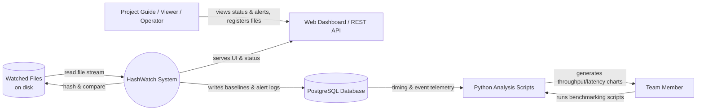
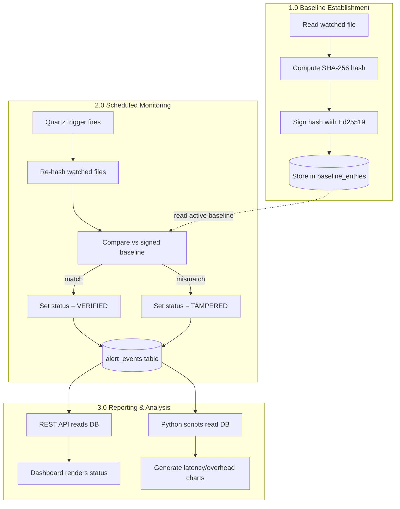
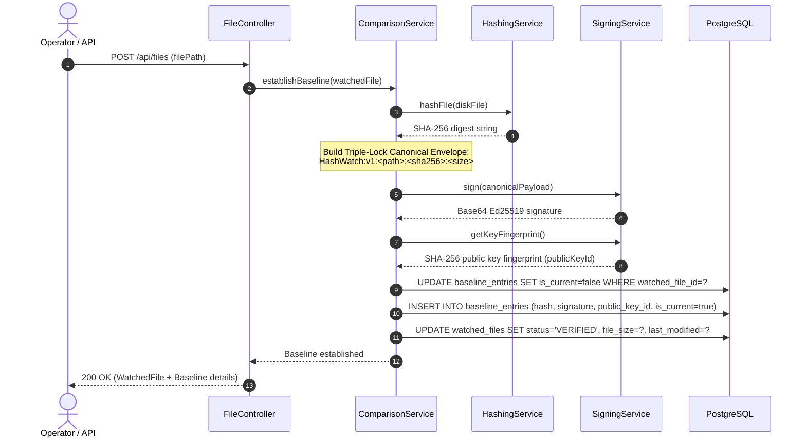
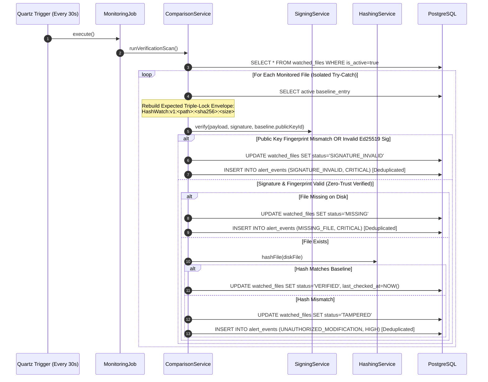

# Data Flow Diagrams (DFD) — HashWatch

---

## 1. Level 0: Context Diagram

### Context Summary
- **External Entities:** Operators/System Administrators, Filesystem, PostgreSQL, and Team Analysts.
- **Boundary:** HashWatch runs as a resident monitoring daemon with an embedded web server, while the Python benchmarking scripts run offline against collected performance data.

---

## 2. Level 1: Process Decomposition

---

## 3. Level 2: Sub-Process Breakdown

### 3.1. Process 1.0 — Baseline Establishment Detail (Sprint 2: S2-T1)

### 3.2. Process 2.0 — Scheduled Verification Loop Detail (Sprint 2: S2-T1)

