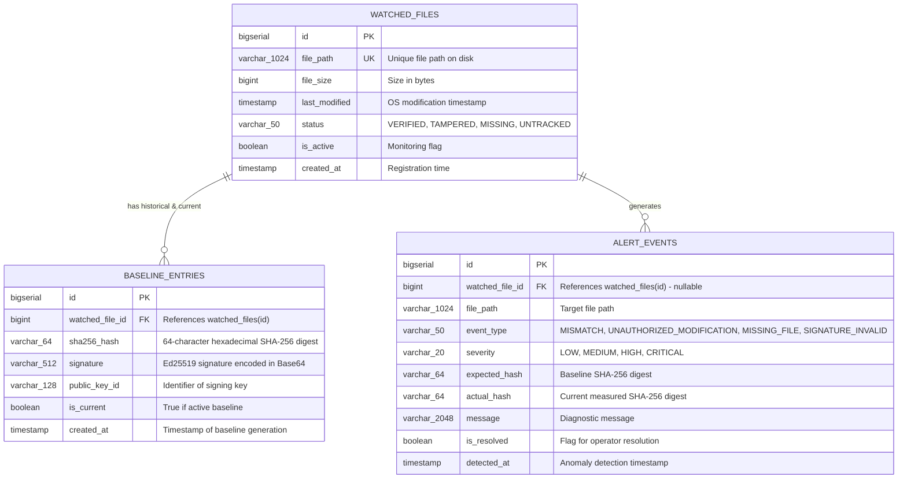

# Entity-Relationship Document (ERD) — HashWatch

---

## 1. Visual Entity-Relationship Diagram



---

## 2. Table Specifications

### 2.1. `watched_files`
Stores the set of files registered for integrity monitoring.

| Column | Type | Nullable | Constraints / Description |
| :--- | :--- | :--- | :--- |
| `id` | `BIGSERIAL` | No | Primary Key |
| `file_path` | `VARCHAR(1024)` | No | Unique index `idx_watched_files_path` |
| `file_size` | `BIGINT` | Yes | Size of file in bytes |
| `last_modified` | `TIMESTAMP` | Yes | Filesystem last modified timestamp |
| `status` | `VARCHAR(50)` | No | Status (`VERIFIED`, `TAMPERED`, `MISSING`, `UNTRACKED`) |
| `is_active` | `BOOLEAN` | No | Default `TRUE` |
| `created_at` | `TIMESTAMP` | No | Default `CURRENT_TIMESTAMP` |

### 2.2. `baseline_entries`
Stores historical and active cryptographic signatures and hashes for monitored files.

| Column | Type | Nullable | Constraints / Description |
| :--- | :--- | :--- | :--- |
| `id` | `BIGSERIAL` | No | Primary Key |
| `watched_file_id` | `BIGINT` | No | Foreign Key $\to$ `watched_files(id)` ON DELETE CASCADE |
| `sha256_hash` | `VARCHAR(64)` | No | SHA-256 digest (hex) |
| `signature` | `VARCHAR(512)` | No | Ed25519 signature (Base64) |
| `public_key_id` | `VARCHAR(128)` | No | Identifier for verification keypair |
| `is_current` | `BOOLEAN` | No | Default `TRUE`. Filter index `idx_baseline_current` |
| `created_at` | `TIMESTAMP` | No | Default `CURRENT_TIMESTAMP` |

### 2.3. `alert_events`
Stores security alerts, mismatch warnings, and tampering logs.

| Column | Type | Nullable | Constraints / Description |
| :--- | :--- | :--- | :--- |
| `id` | `BIGSERIAL` | No | Primary Key |
| `watched_file_id` | `BIGINT` | Yes | Foreign Key $\to$ `watched_files(id)` ON DELETE SET NULL |
| `file_path` | `VARCHAR(1024)` | No | Path of file at alert creation |
| `event_type` | `VARCHAR(50)` | No | e.g. `UNAUTHORIZED_MODIFICATION`, `MISSING_FILE` |
| `severity` | `VARCHAR(20)` | No | `LOW`, `MEDIUM`, `HIGH`, `CRITICAL` |
| `expected_hash` | `VARCHAR(64)` | Yes | Baseline hash |
| `actual_hash` | `VARCHAR(64)` | Yes | Modified disk hash |
| `message` | `VARCHAR(2048)` | Yes | Descriptive explanation |
| `is_resolved` | `BOOLEAN` | No | Default `FALSE` |
| `detected_at` | `TIMESTAMP` | No | Default `CURRENT_TIMESTAMP` |

---

## 3. PostgreSQL DDL Script

```sql
-- Create schema and tables for HashWatch

CREATE TABLE IF NOT EXISTS watched_files (
    id BIGSERIAL PRIMARY KEY,
    file_path VARCHAR(1024) NOT NULL UNIQUE,
    file_size BIGINT,
    last_modified TIMESTAMP,
    status VARCHAR(50) NOT NULL DEFAULT 'UNTRACKED',
    is_active BOOLEAN NOT NULL DEFAULT TRUE,
    created_at TIMESTAMP NOT NULL DEFAULT CURRENT_TIMESTAMP
);

CREATE INDEX IF NOT EXISTS idx_watched_files_active ON watched_files(is_active);

CREATE TABLE IF NOT EXISTS baseline_entries (
    id BIGSERIAL PRIMARY KEY,
    watched_file_id BIGINT NOT NULL REFERENCES watched_files(id) ON DELETE CASCADE,
    sha256_hash VARCHAR(64) NOT NULL,
    signature VARCHAR(512) NOT NULL,
    public_key_id VARCHAR(128) NOT NULL,
    is_current BOOLEAN NOT NULL DEFAULT TRUE,
    created_at TIMESTAMP NOT NULL DEFAULT CURRENT_TIMESTAMP
);

CREATE INDEX IF NOT EXISTS idx_baseline_current ON baseline_entries(watched_file_id, is_current);

CREATE TABLE IF NOT EXISTS alert_events (
    id BIGSERIAL PRIMARY KEY,
    watched_file_id BIGINT REFERENCES watched_files(id) ON DELETE SET NULL,
    file_path VARCHAR(1024) NOT NULL,
    event_type VARCHAR(50) NOT NULL,
    severity VARCHAR(20) NOT NULL,
    expected_hash VARCHAR(64),
    actual_hash VARCHAR(64),
    message VARCHAR(2048),
    is_resolved BOOLEAN NOT NULL DEFAULT FALSE,
    detected_at TIMESTAMP NOT NULL DEFAULT CURRENT_TIMESTAMP
);

CREATE INDEX IF NOT EXISTS idx_alerts_unresolved ON alert_events(is_resolved, detected_at DESC);
```
