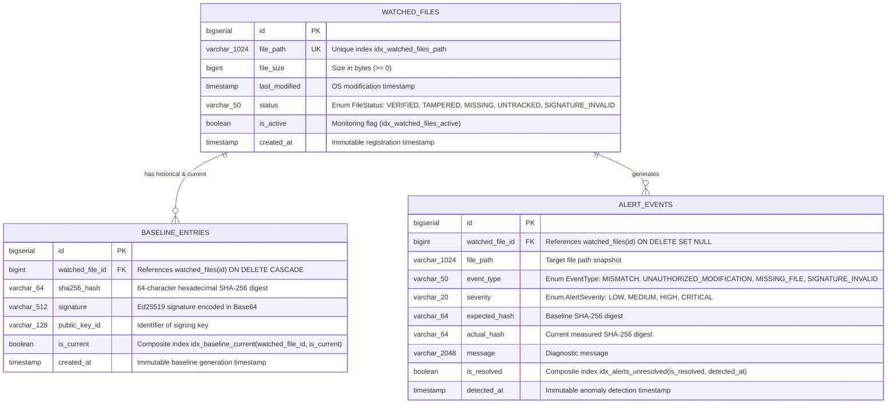

# Entity-Relationship Document (ERD) — HashWatch

---

## 1. Visual Entity-Relationship Diagram



---

## 2. Strongly-Typed Domain Enums (Sprint 1: S1-T4)

All status and classification columns are backed by Java `enum` types annotated with `@Enumerated(EnumType.STRING)` to enforce compile-time type safety while storing readable strings in PostgreSQL/H2:

| Enum Class | Permitted Values | Target Column |
| :--- | :--- | :--- |
| [`FileStatus`](../src/main/java/com/hashwatch/entity/FileStatus.java) | `VERIFIED`, `TAMPERED`, `MISSING`, `UNTRACKED`, `SIGNATURE_INVALID` | `watched_files.status` |
| [`EventType`](../src/main/java/com/hashwatch/entity/EventType.java) | `MISMATCH`, `UNAUTHORIZED_MODIFICATION`, `MISSING_FILE`, `SIGNATURE_INVALID` | `alert_events.event_type` |
| [`AlertSeverity`](../src/main/java/com/hashwatch/entity/AlertSeverity.java) | `LOW`, `MEDIUM`, `HIGH`, `CRITICAL` | `alert_events.severity` |

---

## 3. Table & Index Specifications

### 3.1. `watched_files`
Stores the registry of files monitored by HashWatch.

| Column | Type | Nullable | Constraints & Indexes |
| :--- | :--- | :--- | :--- |
| `id` | `BIGSERIAL` | No | Primary Key |
| `file_path` | `VARCHAR(1024)` | No | `@NotBlank`, Unique Index `idx_watched_files_path` |
| `file_size` | `BIGINT` | Yes | `@PositiveOrZero` (Size in bytes) |
| `last_modified` | `TIMESTAMP` | Yes | Filesystem last modified timestamp |
| `status` | `VARCHAR(50)` | No | `@NotNull`, Default `UNTRACKED`, Index `idx_watched_files_status` |
| `is_active` | `BOOLEAN` | No | Default `TRUE`, Index `idx_watched_files_active` |
| `created_at` | `TIMESTAMP` | No | `@PrePersist` default `NOW()`, `updatable = false` |

### 3.2. `baseline_entries`
Stores historical and active cryptographic signatures and hashes for monitored files.

| Column | Type | Nullable | Constraints & Indexes |
| :--- | :--- | :--- | :--- |
| `id` | `BIGSERIAL` | No | Primary Key |
| `watched_file_id` | `BIGINT` | No | FK `fk_baseline_watched_file` $\to$ `watched_files(id)` `ON DELETE CASCADE` |
| `sha256_hash` | `VARCHAR(64)` | No | `@NotBlank`, `@Size(min=64, max=64)` |
| `signature` | `VARCHAR(512)` | No | `@NotBlank` (Ed25519 Base64 signature) |
| `public_key_id` | `VARCHAR(128)` | No | `@NotBlank` (Keypair identifier) |
| `is_current` | `BOOLEAN` | No | Default `TRUE`, Composite Index `idx_baseline_current(watched_file_id, is_current)` |
| `created_at` | `TIMESTAMP` | No | `@PrePersist` default `NOW()`, Index `idx_baseline_created_at` |

### 3.3. `alert_events`
Stores security alerts, mismatch warnings, and tampering logs.

| Column | Type | Nullable | Constraints & Indexes |
| :--- | :--- | :--- | :--- |
| `id` | `BIGSERIAL` | No | Primary Key |
| `watched_file_id` | `BIGINT` | Yes | FK `fk_alert_watched_file` $\to$ `watched_files(id)` `ON DELETE SET NULL` |
| `file_path` | `VARCHAR(1024)` | No | `@NotBlank` (Snapshot of file path at detection time) |
| `event_type` | `VARCHAR(50)` | No | `@NotNull` (`EventType` enum) |
| `severity` | `VARCHAR(20)` | No | `@NotNull` (`AlertSeverity` enum), Index `idx_alerts_severity` |
| `expected_hash` | `VARCHAR(64)` | Yes | Baseline SHA-256 hash |
| `actual_hash` | `VARCHAR(64)` | Yes | Measured disk SHA-256 hash |
| `message` | `VARCHAR(2048)` | Yes | Diagnostic explanation |
| `is_resolved` | `BOOLEAN` | No | Default `FALSE`, Composite Index `idx_alerts_unresolved(is_resolved, detected_at)` |
| `detected_at` | `TIMESTAMP` | No | `@PrePersist` default `NOW()`, `updatable = false` |

---

## 4. Reference PostgreSQL DDL Script

*(Note: Hibernate generates these tables and indexes automatically via JPA `@Table(indexes = ...)` annotations in both `h2` and `postgres` profiles).*

```sql
CREATE TABLE IF NOT EXISTS watched_files (
    id BIGSERIAL PRIMARY KEY,
    file_path VARCHAR(1024) NOT NULL,
    file_size BIGINT CHECK (file_size >= 0),
    last_modified TIMESTAMP,
    status VARCHAR(50) NOT NULL DEFAULT 'UNTRACKED',
    is_active BOOLEAN NOT NULL DEFAULT TRUE,
    created_at TIMESTAMP NOT NULL DEFAULT CURRENT_TIMESTAMP,
    CONSTRAINT idx_watched_files_path UNIQUE (file_path)
);

CREATE INDEX IF NOT EXISTS idx_watched_files_active ON watched_files(is_active);
CREATE INDEX IF NOT EXISTS idx_watched_files_status ON watched_files(status);

CREATE TABLE IF NOT EXISTS baseline_entries (
    id BIGSERIAL PRIMARY KEY,
    watched_file_id BIGINT NOT NULL,
    sha256_hash VARCHAR(64) NOT NULL,
    signature VARCHAR(512) NOT NULL,
    public_key_id VARCHAR(128) NOT NULL,
    is_current BOOLEAN NOT NULL DEFAULT TRUE,
    created_at TIMESTAMP NOT NULL DEFAULT CURRENT_TIMESTAMP,
    CONSTRAINT fk_baseline_watched_file FOREIGN KEY (watched_file_id)
        REFERENCES watched_files(id) ON DELETE CASCADE
);

CREATE INDEX IF NOT EXISTS idx_baseline_current ON baseline_entries(watched_file_id, is_current);
CREATE INDEX IF NOT EXISTS idx_baseline_created_at ON baseline_entries(created_at);

CREATE TABLE IF NOT EXISTS alert_events (
    id BIGSERIAL PRIMARY KEY,
    watched_file_id BIGINT,
    file_path VARCHAR(1024) NOT NULL,
    event_type VARCHAR(50) NOT NULL,
    severity VARCHAR(20) NOT NULL,
    expected_hash VARCHAR(64),
    actual_hash VARCHAR(64),
    message VARCHAR(2048),
    is_resolved BOOLEAN NOT NULL DEFAULT FALSE,
    detected_at TIMESTAMP NOT NULL DEFAULT CURRENT_TIMESTAMP,
    CONSTRAINT fk_alert_watched_file FOREIGN KEY (watched_file_id)
        REFERENCES watched_files(id) ON DELETE SET NULL
);

CREATE INDEX IF NOT EXISTS idx_alerts_unresolved ON alert_events(is_resolved, detected_at);
CREATE INDEX IF NOT EXISTS idx_alerts_severity ON alert_events(severity);
```
