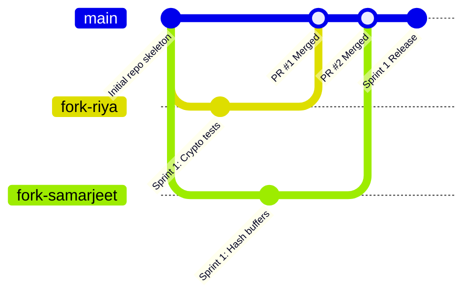

# Team Roles & Agile Sprint Collaboration Model — HashWatch

---

## 1. Domain Specialization Matrix

Our team follows a domain-competency model where teammates possess declared domains of expertise, but work dynamically across weekly sprints.

| Team Member | GitHub Handle | Selected Domains of Work |
| :--- | :--- | :--- |
| **Priyanshu** (Lead) | [`@PG300604`](https://github.com/PG300604) | **Backend**, **DBMS**, **DevOps**, **Analysis**, **Cryptology** |
| **Riya** | Team Contributor | **Cryptology**, **API**, **Frontend**, **DBMS** |
| **Samarjeet** | Team Contributor | **Backend**, **Cryptology** |

---

## 2. Event-Based Development & Dynamic Sprint Allocation

### Why No Rigid Isolated Modules?
In traditional university projects, one person is often permanently locked into "only frontend" or "only database," leading to uneven workload distribution and bottlenecks. 

**HashWatch utilizes Event-Based Agile Development:**
- **Fluid Task Assignment:** Tasks are distributed in **weekly sprints** matching the domains selected, but assignments are flexible. For example, Priyanshu may focus on DBMS schema design in Week 1, and shift workforce to Backend logic in Week 2 if more throughput is required.
- **Equal Hands-On Participation:** Every teammate gets equal hands-on exposure to core system components (especially Cryptology and Backend where domains overlap).
- **Clear Folder Boundaries Per Sprint:** For every weekly sprint, each assigned task specifies:
  1. The exact directory and files to work on.
  2. The input/output contract.
  3. The exact documentation file that must be updated alongside the code changes.

---

## 3. Domain Ownership & Folder Mapping

When working on a sprint task, refer to this domain-to-directory guide:

| Domain | Primary Target Folders / Files | Key Responsibilities |
| :--- | :--- | :--- |
| **Cryptology** | `src/main/java/com/hashwatch/service/HashingService.java`<br>`src/main/java/com/hashwatch/service/SigningService.java`<br>`src/test/java/com/hashwatch/service/` | SHA-256 chunked streaming, Ed25519 key generation, sign/verify cryptographic validation, test vectors. |
| **Backend** | `src/main/java/com/hashwatch/service/ComparisonService.java`<br>`src/main/java/com/hashwatch/scheduler/`<br>`src/main/java/com/hashwatch/config/` | Quartz polling loop, verification state transitions, business logic, file scanning. |
| **DBMS** | `src/main/java/com/hashwatch/entity/`<br>`src/main/java/com/hashwatch/repository/`<br>`src/main/resources/application.properties`<br>`docs/ERD.md` | PostgreSQL entity mappings, JPA query methods, indexing, schema migrations, DDL scripts. |
| **API** | `src/main/java/com/hashwatch/controller/`<br>`docs/TRD.md` (API Section) | REST endpoint contracts (`/api/files`, `/api/baselines`, `/api/alerts`), DTO validation, HTTP status codes. |
| **Frontend** | `src/main/resources/templates/`<br>`src/main/resources/static/css/`<br>`src/main/resources/static/js/` | Thymeleaf templates (`dashboard.html`, `alerts.html`), UI responsiveness, styling, fetch API calls. |
| **DevOps** | `docker-compose.yml`<br>`pom.xml`<br>`.github/workflows/`<br>`docs/SETUP.md` | Docker containerization, CI/CD pipeline, environment configurations, build automation. |
| **Analysis** | `python-analysis/`<br>`docs/RESEARCH_BENCHMARKS.md` | Benchmarking scripts, throughput/latency measurements, statistical plotting, academic comparison. |

---

## 4. Fork & Pull Request (PR) Workflow

To prevent merge conflicts and preserve codebase integrity, all teammates follow the **Forking Workflow**:



### Step 1: Fork the Upstream Repository
1. Navigate to the central repository: [https://github.com/PG300604/HashWatch](https://github.com/PG300604/HashWatch)
2. Click **Fork** (top right) to create a copy under your personal GitHub account.
3. Clone your fork locally:
   ```bash
   git clone https://github.com/<YOUR_USERNAME>/HashWatch.git
   cd HashWatch
   ```
4. Configure upstream remote to stay synced:
   ```bash
   git remote add upstream https://github.com/PG300604/HashWatch.git
   git fetch upstream
   ```

### Step 2: Create a Feature / Sprint Branch
Never commit directly to `main`. Create a descriptive branch for your sprint task:
```bash
git checkout -b sprint-1/cryptology-sha256-tests
# or
git checkout -b sprint-2/api-baseline-endpoints
```

### Step 3: Implement Code & Update Documentation
- Any code change must be accompanied by its corresponding documentation update (e.g., if you add a new endpoint, update `docs/TRD.md`).
- Run local tests before committing:
  ```bash
  mvn test
  ```

### Step 4: Push to Fork and Open Pull Request
```bash
git add .
git commit -m "feat(crypto): add streaming test vectors for SHA-256 buffer"
git push origin sprint-1/cryptology-sha256-tests
```
- Open a Pull Request against `PG300604/HashWatch:main`.
- In the PR description, mention the Sprint number, domain, and linked task.
- Priyanshu will review and merge into `main`.
