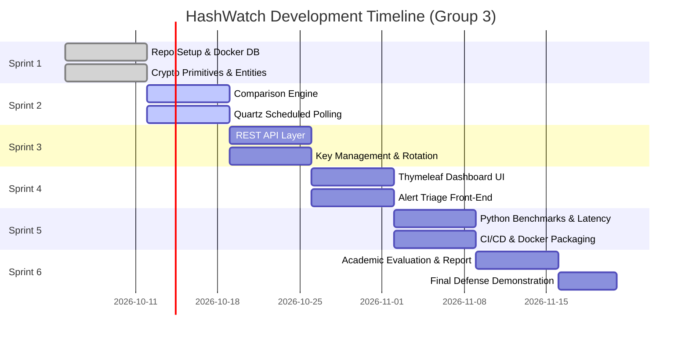

# Project Timeline — HashWatch

```mermaid
gantt
    title HashWatch Development Timeline (Group 3)
    dateFormat  YYYY-MM-DD
    section Sprint 1
    Repo Setup & Docker DB       :done,    des1, 2026-10-05, 7d
    Crypto Primitives & Entities :done,    des2, 2026-10-05, 7d
    section Sprint 2
    Comparison Engine            :active,  des3, 2026-10-12, 7d
    Quartz Scheduled Polling     :active,  des4, 2026-10-12, 7d
    section Sprint 3
    REST API Layer               :         des5, 2026-10-19, 7d
    Key Management & Rotation    :         des6, 2026-10-19, 7d
    section Sprint 4
    Thymeleaf Dashboard UI       :         des7, 2026-10-26, 7d
    Alert Triage Front-End       :         des8, 2026-10-26, 7d
    section Sprint 5
    Python Benchmarks & Latency  :         des9, 2026-11-02, 7d
    CI/CD & Docker Packaging     :         des10, 2026-11-02, 7d
    section Sprint 6
    Academic Evaluation & Report :         des11, 2026-11-09, 7d
    Final Defense Demonstration  :         des12, 2026-11-16, 5d
```

For specific task breakdowns and folder assignments, see [`docs/SPRINT_PLAN.md`](SPRINT_PLAN.md).
