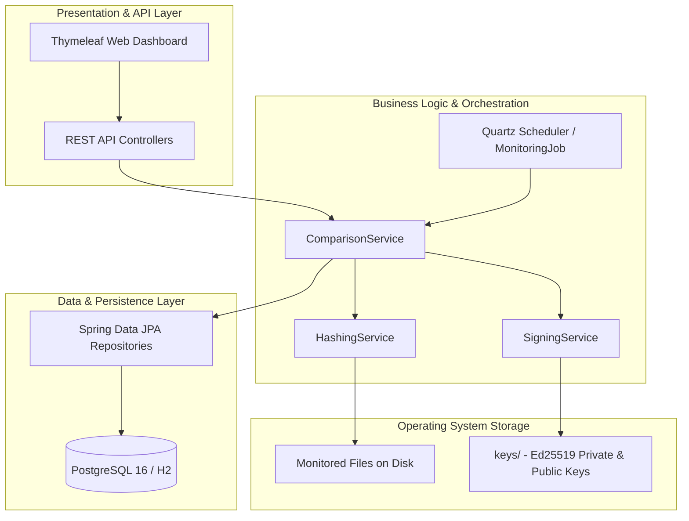

# Technical Requirements Document (TRD) — HashWatch

---

## 1. System Architecture Overview

HashWatch adopts a modular layered architecture built on the Spring Boot 3 ecosystem running on Java 17 LTS. The system is partitioned into:
1. **Core Cryptographic Engine:** Hashing (`SHA-256`) and Digital Signatures (`Ed25519`).
2. **Persistence & Data Layer:** Spring Data JPA with Hibernate, targeting PostgreSQL 16 (with H2 in-memory profile for lightweight local runs).
3. **Orchestration / Scheduling Layer:** Quartz Job Scheduler for reliable, configurable periodic execution.
4. **Presentation & API Layer:** Spring MVC REST controllers accompanied by server-rendered Thymeleaf HTML5 views.
5. **Offline Analysis & Benchmarking Layer:** Python 3 analysis suite consuming database telemetry to benchmark throughput and latency.



---

## 2. Technology Stack & Rationale

| Layer | Technology | Version | Rationale |
| :--- | :--- | :--- | :--- |
| **Language** | Java | 17 (LTS) | Strong typing, LTS stability, native JCA Ed25519 support (JEP 339), modern heap memory management. |
| **Build Tool** | Apache Maven Wrapper | 3.9.9 (`mvnw`) | Zero-binary (`only-script`) wrapper ensures identical build environment across Windows, Linux, and CI. |
| **Framework** | Spring Boot | 3.3.4 | Industry-standard dependency injection, autoconfiguration, embedded Tomcat, native metrics. |
| **Database** | PostgreSQL | 16-alpine | Enterprise ACID compliance, robust indexing on hashes and timestamps, production standard. |
| **Fallback DB** | H2 Database | 2.x | Zero-setup in-memory database for rapid onboarding and `@DataJpaTest` unit testing. |
| **Connection Pool** | HikariCP | 5.x | High-performance JDBC connection pooling (`HashWatchHikariPool`: max 10, min idle 2). |
| **Scheduler** | Quartz Scheduler | 2.3.x | Enterprise job clustering support, durable job details, flexible cron and simple trigger intervals. |
| **Cryptography** | Java JCA + BouncyCastle | 1.78.1 | RFC 8032 Ed25519 compliant, PKCS#8 and X.509 standard key encodings. |
| **Frontend** | Thymeleaf + CSS/JS | 3.x | Zero-node build step, server-side rendered, lightweight, high performance. |
| **Analysis** | Python + Matplotlib + NumPy | 3.12+ | Rich statistical packages for CDF/PDF latency plotting and research comparison. |

---

## 3. Cryptographic Implementation Details

### 3.1. SHA-256 Streaming
Rather than loading an entire file into memory (which causes `OutOfMemoryError` on large files), HashWatch processes files in chunks:
```java
MessageDigest digest = MessageDigest.getInstance("SHA-256");
try (FileInputStream fis = new FileInputStream(file)) {
    byte[] buffer = new byte[65536]; // 64 KB buffer
    int bytesRead;
    while ((bytesRead = fis.read(buffer)) != -1) {
        digest.update(buffer, 0, bytesRead);
    }
}
String hexDigest = HexFormat.of().formatHex(digest.digest());
```
- **Time Complexity:** $\mathcal{O}(N)$ where $N$ is file size.
- **Space Complexity:** $\mathcal{O}(1)$ bounded to 64 KB heap allocation.
- **Implementation:** [`HashingService.java`](../src/main/java/com/hashwatch/service/HashingService.java) implements `hashFile(File)` and `hashString(String)` with explicit null/existence checks and lowercase 64-char hex outputs.
- **Test Verification:** [`HashingServiceTest.java`](../src/test/java/com/hashwatch/service/HashingServiceTest.java) validates empty string RFC vector (`e3b0c44...`), file modification sensitivity, and input boundary exception handling (5/5 unit tests passing).

### 3.2. Ed25519 Digital Signatures (Edwards-curve Digital Signature Algorithm) — (Sprint 1: S1-T2)
- **Implementation:** [`SigningService.java`](../src/main/java/com/hashwatch/service/SigningService.java) utilizing Java 17 LTS native JCA (`SunEC` / JEP 339).
- **Curve:** Curve25519 with Twisted Edwards model ($ -x^2 + y^2 = 1 - \frac{121665}{121666} x^2 y^2 $).
- **Key Formats & Persistence:**
  - **Private Key:** Stored at `keys/ed25519_private.key` as Base64-encoded PKCS#8 (`PKCS8EncodedKeySpec`).
  - **Public Key:** Stored at `keys/ed25519_public.pub` as Base64-encoded X.509 (`X509EncodedKeySpec`).
  - **Auto-Initialization:** `@PostConstruct` automatically resolves the key directory (configurable via `hashwatch.crypto.key-directory`), creates it if absent, loads existing keys, or generates a fresh 256-bit keypair on initial boot.
- **Signature Specification:**
  - **Signature Algorithm:** Standard Ed25519 (RFC 8032) producing raw 64-byte cryptographic signatures encoded in Base64 string format (~86-88 characters).
  - **Signing:** Computes signature over UTF-8 bytes of SHA-256 digest strings using `Signature.getInstance("Ed25519")`.
  - **Verification & Tamper Resilience:** Validates signature against provided string data. Gracefully catches null/blank inputs, malformed Base64, and corrupted byte arrays, returning `false` (`SIGNATURE_INVALID`) rather than throwing unhandled runtime exceptions.
- **Security Guarantee:** 128-bit security level against collision and discrete logarithm attacks; immune to timing side-channel attacks. The private key is excluded in `.gitignore` and never exposed over the REST API.
- **Verification Suite:** Validated by 5 automated tests in [`SigningServiceTest.java`](../src/test/java/com/hashwatch/service/SigningServiceTest.java) covering genuine signing/verification, tampered digest rejection, cross-instance key persistence reload, and malformed signature handling.

---

## 4. Database Design, Connection Pooling & Persistence (Sprint 1: S1-T1 & S1-T4)

### 4.1. Dual-Profile & HikariCP Configuration
- **Default Profile (`h2`):** Activated in [`application.properties`](../src/main/resources/application.properties) (`spring.profiles.active=h2`) using [`application-h2.properties`](../src/main/resources/application-h2.properties) for instant zero-setup development and automated testing.
- **Production Profile (`postgres`):** Activated via `-Dspring-boot.run.profiles=postgres` using [`application-postgres.properties`](../src/main/resources/application-postgres.properties) targeting PostgreSQL 16 (`localhost:5432/hashwatch_db`).
- **HikariCP Settings (`HashWatchHikariPool`):**
  - `maximum-pool-size=10`, `minimum-idle=2`, `idle-timeout=300000` (5m), `connection-timeout=20000` (20s), `max-lifetime=1800000` (30m).
  - `spring.jpa.open-in-view=false` to enforce clean transaction boundaries before the view layer.

### 4.2. Strongly-Typed Domain Enums & Schema Migration Safety
All status and classification fields use Java `enum` types annotated with `@Enumerated(EnumType.STRING)` and `@ColumnDefault` so database migrations and native SQL inserts remain safe:
- [`FileStatus`](../src/main/java/com/hashwatch/entity/FileStatus.java): `VERIFIED`, `TAMPERED`, `MISSING`, `UNTRACKED` (default via `@ColumnDefault("'UNTRACKED'")` and `@PrePersist`), `SIGNATURE_INVALID`.
- [`EventType`](../src/main/java/com/hashwatch/entity/EventType.java): `MISMATCH`, `UNAUTHORIZED_MODIFICATION`, `MISSING_FILE`, `SIGNATURE_INVALID`.
- [`AlertSeverity`](../src/main/java/com/hashwatch/entity/AlertSeverity.java): `LOW`, `MEDIUM`, `HIGH`, `CRITICAL`.

### 4.3. Relational Tables & Referential Integrity
1. **`watched_files` ([`WatchedFile.java`](../src/main/java/com/hashwatch/entity/WatchedFile.java))**: Registry of monitored paths, status, size, and modification timestamps. Indexed by `idx_watched_files_path` (unique), `idx_watched_files_active`, and `idx_watched_files_status`.
2. **`baseline_entries` ([`BaselineEntry.java`](../src/main/java/com/hashwatch/entity/BaselineEntry.java))**: Immutable snapshots containing the 64-character SHA-256 hash, Ed25519 signature, and `is_current` flag. Foreign key `fk_baseline_watched_file` enforces **`ON DELETE CASCADE`** when a parent `WatchedFile` is deleted.
3. **`alert_events` ([`AlertEvent.java`](../src/main/java/com/hashwatch/entity/AlertEvent.java))**: Audit trail of integrity violations. Foreign key `fk_alert_watched_file` enforces **`ON DELETE SET NULL`** so historical security alerts and their `file_path` snapshots survive even if a monitored file record is later deleted.

### 4.4. Automated `@DataJpaTest` Verification ([`RepositoryIntegrationTest.java`](../src/test/java/com/hashwatch/repository/RepositoryIntegrationTest.java))
8 integration tests validate the persistence layer:
1. `testSaveAndQueryWatchedFile` — `@PrePersist` defaults and active/status queries.
2. `testAllEnumValuesMapToDatabaseStrings` — Persists and retrieves all 5 `FileStatus` values and all $4 \times 4 = 16$ `EventType` $\times$ `AlertSeverity` combinations, verifying exact `VARCHAR` representations in the database.
3. `testSchemaMigrationAndRowsMissingStatusDefaultToUntracked` — Verifies pre-existing rows missing `status` default to `FileStatus.UNTRACKED`.
4. `testUniqueFilePathConstraint` — Verifies `DataIntegrityViolationException` on duplicate `file_path`.
5. `testBaselineRotationAndLookup` — Verifies baseline creation, retirement (`is_current = false`), and historical ordering.
6. `testAlertEventPersistenceAndTriage` — Verifies alert logging, unresolved queries, and resolution updates.
7. `testDeleteWatchedFileCascadesToBaselineAndSetsNullOnAlertEvent` — Verifies `ON DELETE CASCADE` on `baseline_entries` and `ON DELETE SET NULL` on `alert_events`.
8. `testAlertEventCreationWithNullWatchedFileReference` — Verifies detached `AlertEvent` persistence with `watched_file_id = NULL`.

*(See [`docs/ERD.md`](ERD.md) for full SQL definitions and Mermaid entity schemas).*

---

## 5. REST API Specifications

### Base Path: `/api`

#### 1. Watched Files
- **`GET /api/files`**
  - Response: `200 OK` — List of `WatchedFile` objects.
- **`POST /api/files`**
  - Request Body: `{"filePath": "/path/to/file"}`
  - Response: `200 OK` — Created `WatchedFile` with initial baseline established.
  - Error: `400 Bad Request` if file path is missing or non-existent on disk.
- **`DELETE /api/files/{id}`**
  - Response: `200 OK` — Deactivates file from active monitoring.

#### 2. Baselines
- **`GET /api/baselines`**
  - Response: `200 OK` — List of all active `BaselineEntry` records.
- **`GET /api/baselines/public-key`**
  - Response: `200 OK` — `{"algorithm": "Ed25519", "publicKey": "<base64>"}`
- **`POST /api/baselines/generate/{fileId}`**
  - Response: `200 OK` — Recomputes SHA-256, resigns with Ed25519, updates active baseline.
- **`POST /api/baselines/generate-all`**
  - Response: `200 OK` — Re-baselines all active files.

#### 3. Alerts & Verification
- **`GET /api/alerts`**
  - Response: `200 OK` — List of unresolved security alerts.
- **`POST /api/alerts/{id}/resolve`**
  - Response: `200 OK` — Marks alert as resolved (`is_resolved = true`).
- **`POST /api/alerts/scan-now`**
  - Response: `200 OK` — Triggers an immediate out-of-band verification scan.

---

## 6. Offline Statistical & Benchmarking Suite

Located in `python-analysis/`:
- **`overhead_benchmark.py`**: Benchmarks hashing speed across file sizes (1MB to 100MB) and Ed25519 signing/verifying speeds against academic benchmarks.
- **`latency_analysis.py`**: Calculates mean, median, 95th percentile detection latency over periodic scan distributions.
- **`charts/`**: Automatically outputs publication-ready figures for project reports and presentation slides.
